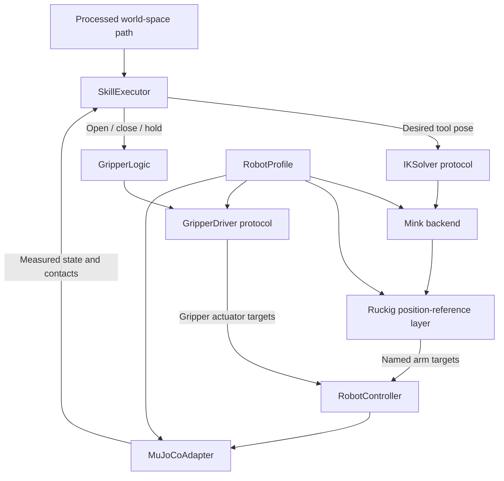

# IK and gripper implementation plan

Status: implemented and physically stepped in MuJoCo on 2026-08-31. See
`docs/ROBOT_EXECUTION.md` for the authoritative interfaces, configuration, and
successful fixed-fixture verification. This document preserves the planning
rationale and records where measured behavior required a controller correction.

Recommend **Mink with its DAQP solver backend, the standard MuJoCo Menagerie Panda model, and a small model-specific gripper adapter**. Keep semantic execution and solver interfaces independent of Panda joint counts, actuator indices, and upstream perception.

## Scope and repository findings

The requested execution block is numbered **5: Skill Executor, 6: IK Solver, 7: Gripper Logic** in `robot-framework-pipeline.txt`. This plan covers those three together, plus the minimum controller/simulation interfaces needed to test them. Steps 1–4 and upstream ML are outside scope.

The existing design already requires conventional IK, separate gripper control, fixed downward orientation, processed Cartesian paths, and simulation-only execution. Preserve those invariants and the four learned labels.

Relevant findings:

- `src/mimic/robot/` contains only an export scaffold. No scene, IK, controller, or gripper implementation exists yet. README script names describe intended entry points, not implemented programs.
- `common/types.py` already defines `RobotCommand` with Cartesian position, optional quaternion, gripper-open flag, phase, and duration. Preserve this interface; adapt it at the robot boundary rather than replacing it.
- Quaternion order, target reference frame, and the physical tool center point are not specified precisely enough for IK.
- Configuration specifies 100 Hz arm control and 10 Hz gripper control. The architecture document's performance table instead says 10 Hz arm control. Use the existing configuration as the proposed baseline, document the discrepancy, and do not invent a new rate.
- Task height defaults differ between the shared dataclass and configuration. Exact table/object geometry and placement-success tolerance are unresolved. They must not be inferred from convenient test results.
- Existing integration tests contain empty bodies. Passing them would not verify robot execution.

The linked [RoboDK Panda page](https://robodk.com/robot/Franka/Emika-Panda) returned a browser verification page during review. No kinematic or actuator assumptions below are taken from it. Use the actual simulation model as the execution authority; do not mix Panda and Franka Research 3 descriptions.

## Reuse existing resources

| Resource | Proposed use | Reason |
| --- | --- | --- |
| [Mink](https://github.com/kevinzakka/mink) | Default IK backend | Uses MuJoCo kinematics; includes examples for Panda and other robots. Avoids maintaining a separate hand-coded kinematic chain. |
| [Mink dependency specification](https://github.com/kevinzakka/mink/blob/main/pyproject.toml) | DAQP through `qpsolvers` | Use the backend included by the selected Mink release; do not implement numerical optimization. |
| [MuJoCo Menagerie Panda](https://github.com/google-deepmind/mujoco_menagerie/tree/main/franka_emika_panda) | Robot, hand, collision geometry, and actuator definitions | Reuse the standard `panda.xml` model and its physical gripper mechanism. Preserve its license and provenance. |
| [Mink Panda example](https://github.com/kevinzakka/mink/blob/main/examples/arm_panda.py) | Reference for task setup and solver integration | Useful starting point, but it uses an MJX scene. Do not copy its actuator slicing or numerical settings into this project. |
| [Ruckig](https://docs.ruckig.com/index.html) | Persistent position-reference motion generation | Reuses a maintained online trajectory generator with explicit velocity, acceleration, and jerk constraints. |
| [Franka FER limits](https://frankarobotics.github.io/docs/robot_specifications.html#limits-for-franka-emika-robot-fer) | Hardware velocity, acceleration, and jerk ceilings | Supplies values absent from the Menagerie MJCF; the simulation operating speed remains lower and explicit. |

Mink 1.3.0 and Ruckig 0.19.4 are pinned in the Python >=3.10 `robot`
dependency group and resolved in `uv.lock`. The base package's Python >=3.9
declaration is unchanged. The selected set was imported and exercised on macOS
ARM64; Linux remains unverified.

Prefer a pinned Menagerie asset snapshot containing only the required model/assets, with source revision and license recorded. Keep the table, object, and any explicit tool-site addition in a local scene composition. Avoid runtime downloads and changes to upstream gains, limits, friction, or collision behavior.

Alternatives considered: [Pink](https://github.com/stephane-caron/pink) offers IK through Pinocchio, but would introduce another kinematic representation for this MuJoCo-only MVP. [dm_control's IK utility](https://github.com/google-deepmind/dm_control/blob/main/dm_control/utils/inverse_kinematics.py) is a possible pose-solving alternative; adopting it would require separately assessing the required constraints and failure behavior. Neither should be installed as an automatic fallback. A solver change must remain visible in logs and configuration.

## Modular boundaries

Use small Python protocols and constructor injection, with an explicit factory at the simulation entry point. No plugin registry, ROS stack, generic robotics framework, or class hierarchy is needed.

Suggested implementation locations, retaining the existing documented module names where practical:

| Location under `src/mimic/` | Responsibility |
| --- | --- |
| `common/types.py` | Add only shared result/state types needed across boundaries; preserve existing constructors. |
| `robot/model.py` | `RobotProfile` and validation of model bindings. |
| `robot/inverse_kinematics.py` | Robot-independent `IKSolver` protocol and result semantics. |
| `robot/backends/mink_ik.py` | Mink implementation; only this module exposes Mink internals. |
| `robot/backends/ruckig_position.py` | Position-actuator trajectory layer; only this module exposes Ruckig internals. |
| `robot/gripper.py` | Generic open/close/hold lifecycle, feedback interpretation, and `GripperDriver` protocol. |
| `robot/backends/panda_gripper.py` | Panda actuator conversion and finger/contact bindings. |
| `robot/state_machine.py` | `SkillExecutor`: sequencing and completion/failure gates. |
| `robot/controller.py` | Validate and combine disjoint arm/gripper targets; no IK or phase inference. |
| `robot/simulation.py` | `RobotIO` protocol implementation; owns live MuJoCo state, control writes, and stepping. |

Load a proposed `configs/robots/panda.yaml` through the existing configuration system. Its profile identifies model assets, ordered arm joint names, corresponding actuators, tool frame, gripper driver, home configuration, and documented limits. Resolve names to MuJoCo joint IDs, position addresses, velocity addresses, and actuator IDs once at startup. Never assume `qpos[:7]`, `ctrl[:7]`, or `nq == nv`.

Positions and limits come from the loaded model where it defines them. Velocity limits and execution settings require explicit sources/configuration; joint position ranges alone do not supply speed limits. Reject unsupported actuator modes rather than interpreting torque controls as joint positions.

Implemented contracts:

- **Robot state:** timestamp, named arm positions/velocities, actual tool pose, gripper feedback; simulation-specific object/contact observations are available to evaluation through the adapter.
- **IK input:** validated world-space tool pose, current state, and control interval in seconds. It never accepts normalized human coordinates or phase scores.
- **IK result:** status (`VALID_STEP`, `AT_TARGET`, `INVALID_INPUT`, `LIMIT_VIOLATION`, or `SOLVER_FAILED`), named joint targets when valid, position/orientation errors, and elapsed solve time. Numerical progress is not proof of global reachability.
- **Gripper input/output:** semantic open/close/hold request, measured status, and named actuator targets. Robot-specific nominal and safe-open widths stay in the injected driver. A close command is not a successful grasp.
- **Robot IO:** state observation, application of validated targets, and simulation stepping. Live MuJoCo objects never escape into skill logic.

The `RobotCommand` adapter requires an explicitly configured world frame and
orientation convention. The robot boundary uses `(w, x, y, z)`, with a tested
conversion for a declared external convention. An omitted orientation means the
configured fixed downward orientation, not an identity quaternion. The exact
downward yaw and hand-to-tool transform remain scene-specific.

A different fixed-base arm using compatible position actuators should require a new profile and, if necessary, a new gripper driver. A torque-controlled arm requires a different controller adapter. Mobile bases and dexterous hands are not promised to be configuration-only substitutions. None of these changes should affect temporal predictions, tracking, or task semantics.

## IK behavior

The implemented method separates geometric IK from position-actuator command
generation. Mink is seeded from measured state and iterated only in private state
to obtain a pose endpoint correction. Ruckig advances a persistent named joint
reference toward that endpoint with explicit per-joint motion limits. When the
reference finishes but measured Cartesian error remains, a new correction is
planned. The real arm moves only through actuators, and measured state remains
authoritative for arrival and safety gates.

Mink provides frame objectives, limits, equality constraints, and a velocity-valued solve result. Use its API instead of duplicating Jacobians, pose-error mathematics, or the optimizer. [Solver API](https://kevinzakka.github.io/mink/api/inverse_kinematics.html), [limits](https://kevinzakka.github.io/mink/api/limits.html).

1. Validate finite inputs, positive `dt`, quaternion norm/convention, frame bindings, and the existing workspace restrictions. Reject an out-of-workspace target; do not clamp it into a different task.
2. Use one frame task for the physical tool center, including the fixed orientation. A configurable posture objective can resolve redundancy toward an approved reference posture; its weight and damping are explicit design choices, not hidden defaults copied from an example.
3. Include joint-position and sourced velocity limits explicitly. Freeze every non-arm degree of freedom in the private solve, including fingers and the object's free joint, with Mink's equality-constraint mechanism. A soft posture objective is insufficient for this isolation. [DOF-freezing implementation](https://github.com/kevinzakka/mink/blob/main/src/mink/tasks/dof_freezing_task.py).
4. Use strict out-of-limit handling and report solver failures. Validate the resulting arm targets against model/actuator limits and the permitted per-tick change. Map only arm results to arm actuators.
5. Determine actual arrival using measured tool pose, with separate translation and rotation tolerances. Track target error over time and stop phase progression on timeout or lack of progress. Local nonconvergence does not prove that no solution exists.

Private endpoint iteration is never sent as one physical control tick. Its result
is passed to Ruckig and advanced at the real control interval. Endpoint validity
alone remains only a kinematic result; measured simulation state gates execution.

Collision avoidance is separate from pose convergence. Preserve all simulation collisions. If adding Mink collision constraints, explicitly define protected pairs and margins, including the intended finger–object contact exception; do not disable physical contacts. Global planning remains outside this step. A kinematically valid solution is not automatically collision-free or dynamically trackable.

## Gripper behavior

For the inspected **standard** Panda XML, fingers are coupled through an equality constraint and tendon. Each finger slides through 0–0.04 m; `actuator8` uses 0–255 controls. With nominal opening `w = q_left + q_right`, the derived target conversion is `u = 255 * w / 0.08`: closed is 0 and fully open is 255. This is a target conversion, not a measurement of achieved opening. Validate the pinned model's transmission, ranges, and gains at startup; reject a mismatch. The standard XML lacks a tool site, so define its physical location explicitly rather than assuming the hand origin is the grasp center. [Panda XML](https://github.com/google-deepmind/mujoco_menagerie/blob/main/franka_emika_panda/panda.xml).

Keep this mapping exclusively in the Panda driver. The MJX variant changes the gripper mechanism/control range and needs its own validated mapping. Reuse the physical model's actuation; do not introduce a second PID, an object weld, or an artificial attachment. [Model differences](https://github.com/google-deepmind/mujoco_menagerie/tree/main/franka_emika_panda).

Generic gripper logic should issue a target on entry to a subskill, retain it between scheduled updates, observe actual finger motion, and expose opening/closing/holding/failure status. Repeated requests must not reset completion timers. Width limits, movement timeout, and grasp criteria are configuration, with no silent clipping or retries.

Proposed execution sequence:

| Learned phase | Internal execution | Completion evidence |
| --- | --- | --- |
| HOVER | Open; hover above start | Gripper open and measured tool pose reached. |
| GRASP | Descend; close | Descent reached; candidate grasp supported by contact with the target object on both fingers and plausible opening. |
| CARRY | Lift; follow processed path; retain closure | Lift confirms the object leaves support and remains held; monitor object/tool relative motion during transport. |
| RELEASE | Lower; open; retreat | Lowering reached; fingers open; object separates, remains at the destination, and settles after retreat. |

Candidate grasp and confirmed transport must remain separate observations. Empty closure, one-sided contact, and contact with the table must not count as a successful grasp. All contact duration, lift, slip, settling, and placement thresholds need explicit definitions before acceptance tests.

The implemented failure policy aborts the execution attempt, stops simulation
stepping, and retains a diagnostic snapshot on IK, grasp, or transport failure.
It does not advance to CARRY after a failed grasp or automatically open a held
object after an arm failure.

## Implementation record and acceptance checks

The implementation followed these reviewable increments:

1. **Settle contracts and dependency compatibility.** Record Python support, model revision, tool transform/orientation, rates, and acceptance parameters. Validate a pinned dependency set on the target Mac and Linux environment. Add no upstream ML dependencies to robot imports.
2. **Load the scene and bind the profile.** The standard Panda diagnostic adds a table and one explicitly defined graspable object, validates names, addresses, transmissions, joint/actuator limits, and home pose, and steps headlessly.
3. **Exercise the gripper in isolation.** Hold a known arm target; command open/close through the real tendon actuator. Check measured finger movement, direction, and limits. Test intermediate widths and ensure arm commands remain untouched.
4. **Add Mink IK and arm actuation.** Test poses produced by forward kinematics from known valid configurations, a short smooth Cartesian path, limit-adjacent inputs, invalid poses, and a deliberately unreachable target. Compare achieved poses, not exact joint vectors: Panda is redundant. Verify the solver cannot mutate live state or command fingers/object joints.
5. **Integrate skills using a manual task.** Use the canonical manually constructed pick-and-place task; supply already retargeted/processed waypoints at this block's boundary. No vision dependency. Verify descent before closure, lift before transport, lowering before opening, and guarded failure transitions.
6. **Prove the abstraction boundary.** Run the same IK contract suite against a second small fixed-base MuJoCo arm fixture with a different joint count, name order, and extra non-arm joints. Test the generic gripper lifecycle with a second driver fixture. This verifies modularity, not a second robot's full pick-and-place capability.

Add focused tests under `tests/test_robot/`, using the established `uv run pytest tests/test_robot/` command after dependencies and tests exist. Add a headless manual-task simulation entry point and a separate integration test using real MuJoCo stepping. Unit fakes are appropriate for sequencing/failure tests, not for claiming physical grasp success.

Record simulation timestamps, skill transitions, model/library versions, full parameter snapshot, IK status/error/latency, commanded and observed arm/gripper state, contacts, grasp/transport/release evidence, final placement error in meters, and success under the explicitly configured tolerance. Measure solver latency against the configured control interval; do not change the rate to make a slow implementation pass.

## Remaining integration decisions

The fixed diagnostic is runnable, but the general Panda configuration still
requires:

- Exact world/table/tool frames, quaternion convention, fixed downward orientation including yaw, and initial scene/object geometry.
- Which height configuration is authoritative, plus posture preference and IK solver parameters.
- IK arrival and failure criteria; grasp, slip, release, settling, and final-placement acceptance tolerances.
- Any optional collision-aware/global planning policy.

Document accepted conventions in the configuration and `AGENTS.md` before use. No numerical tuning, frame flips, safety-limit changes, or task-interface redesign should be used to hide a failed experiment.

Verification performed: dependency/import checks, focused robot tests, Panda IK
and finger motion, a second two-axis robot fixture, and a successful simulated
Panda pick-and-place using a manually constructed task. Not performed: Linux,
upstream perception integration, varied-object calibration, or hardware execution.
